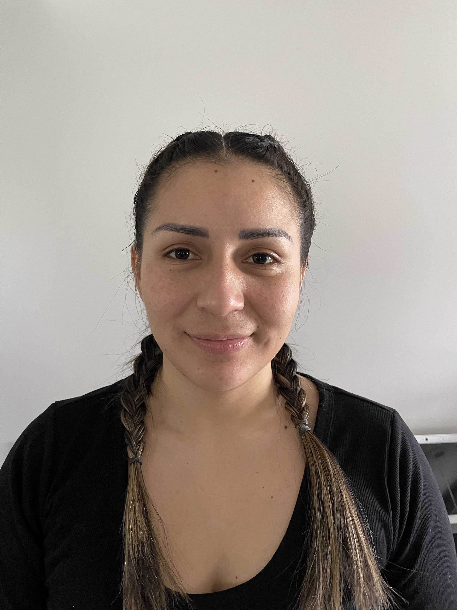

# Web-Development-in-Class

	 I am presently studying Computer Science and I want to become a Web Developer. The experiences that I have is that I was part of a project to develop a “Shoe Store” website. I was the one who created the database tables for the website which gave me knowledge about MySQL and how it works. Also, I had to learn the basics of HTML and CSS. Before this project I only knew Java and I knew about CSS and HTML, but I had never implemented it. However, after the project I gained experience in PHP, CSS, HTML and MySQL. 

	I would like to learn how to develop applications and programs. Also, I am exiting to learn about the steps that we are going to make to create the fitness app. Since we are going to implement full stack with NodeJS and Vue. I know this class will be challenging because it comprises learning new technologies, and at the same time, it will be interesting.
	Since, I became a mom and a housewife, it has been a little bit difficult to find time to study. However, I try to manage my time between studies and motherhood. 

